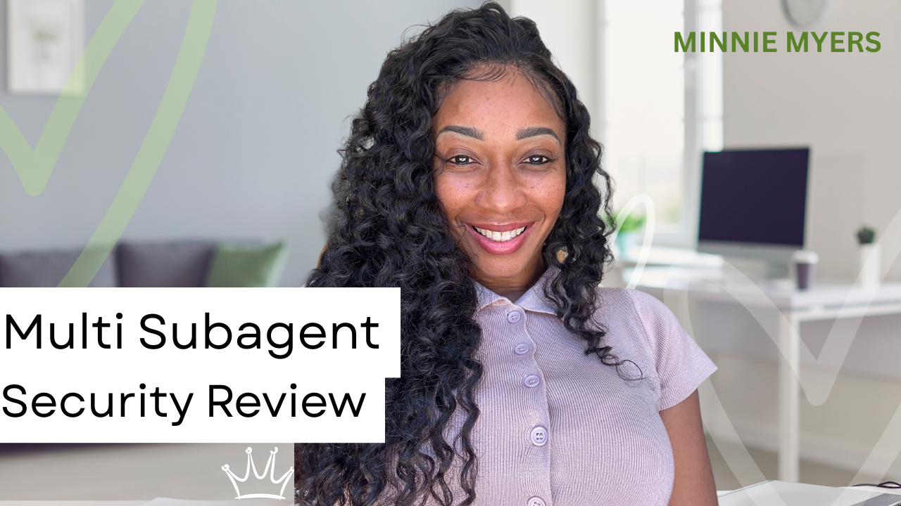

# Multi Subagent Security Review

A parallel deployment of seven specialized AI subagents performing a full lifecycle security code review, from architecture mapping to validated, remediated findings.

## Overview

This project performs a full lifecycle security review using seven specialized AI subagents, each one handling a distinct phase of the process, from architecture mapping all the way to validated, remediated findings. Rather than relying on a single pass, the pipeline builds understanding in layers: mapping the system, tracing how data moves through it, hunting for real exploitable issues, scoring their risk, fixing them, and finally validating the results before anything is reported.

This repository includes:

* **Subagent Prompt (Security Code Review)**: The full seven agent prompt structure defining each agent's role, output format, and handoff rules. See [subagent_prompt_security_code_review.pdf](./subagent_prompt_security_code_review.pdf)
* **SECURITY_REVIEW_REPORT.md**: The final compiled security report generated by the pipeline (Date Generated: 2026 06 06)

I built this as a way to explore what multi agent orchestration can do for security work, and to see how far a structured, layered approach could take a review compared to a single pass. If you're curious about agent pipelines, security methodology, or just want a real example to learn from, this repo should give you a solid look under the hood.

## Demo

Watch a full walkthrough of this project on YouTube: 

The video covers deploying seven specialized Claude Code subagents in parallel to perform an end to end security review, from architecture and threat modeling through attack surface mapping, data flow analysis, vulnerability identification, risk scoring, remediation, and final validation.

Connect with me on LinkedIn: 

## Tools Used

* **Claude Code**: Orchestrated all seven subagents, each with a defined role, instructions, and output format
* **OWASP Juice Shop**: The intentionally vulnerable web application used as the target for this security review
* **OWASP Top 10**: Served as the vulnerability classification framework used by the Hunter and Risk Analyst agents
* **VS Code**: Coding environment used throughout the project to build the prompt structure and review outputs

## The Seven Subagents

1. **ARCHITECT**: Maps the application architecture, authentication and session mechanisms, external integrations, trust boundaries, and sensitive assets
2. **MAPPER**: Identifies every entry point where untrusted input enters the system, including hidden inputs like headers, JWTs, and file uploads
3. **DATA FLOW ANALYST**: Traces full execution paths from input through processing, database, and response, flagging missing validation, sanitization, and authorization checks
4. **HUNTER**: Identifies real, exploitable vulnerabilities mapped to OWASP Top 10 categories, with exact file, function, and line level detail
5. **RISK ANALYST**: Scores each vulnerability using CVSS v3.1, attack vector, complexity, privileges required, and business impact
6. **FIXER**: Provides secure, framework aligned code fixes and defensive controls for each finding
7. **VALIDATOR**: Evaluates findings to remove false positives and ensure all subagents are adhering to their respective frameworks, then produces a preliminary summary to send to the main agent, who reviews a final time before submitting the deliverable to the user

## Top 5 Critical Vulnerabilities Found

**SQL Injection, Login Endpoint**
The attacker manipulates login input so the application's SQL query returns a valid user record, allowing authentication bypass.
Mitigation: Parameterized queries so the database treats input as data only, plus a WAF.

**SQL Injection, Search**
The attacker manipulates the search query to gain full database access, enabling deletion, extraction, or modification of database tables.
Mitigation: Parameterized queries and input validation.

**Hardcoded JWT Secret**
The JWT private key used for authentication was hardcoded in the application's source code, exposing it to anyone with source code access.
Mitigation: Store the secret in AWS Secrets Manager and rotate the JWT private key immediately.

**IDOR in Payment Methods**
An attacker manipulates an object identifier to access another user's financial information, including payment tokens, cardholder name, payment method, and billing address.
Mitigation: Server side authorization checks confirming the payment belongs to the currently authenticated user.

**Server Side Request Forgery (SSRF)**
The attacker manipulates the server into making unauthorized network requests to internal databases or APIs on the attacker's behalf.
Mitigation: Strict allowlist restricting the server to trusted endpoints only.

## Acknowledgments

This project was built as part of hands on learning through a Udemy course on AI agent security, taught by Instructor Taimur Ijlal. The STRIDE threat modeling methodology follows what was taught in that course, adapted and applied here with my own AI agent.

## Disclaimer

This project was performed against an intentionally vulnerable web application built for security practice and training. It was not performed against any real, production, or third party system.

This repository reflects personal learning and practice. It is not an official, professional, or vetted security policy.
